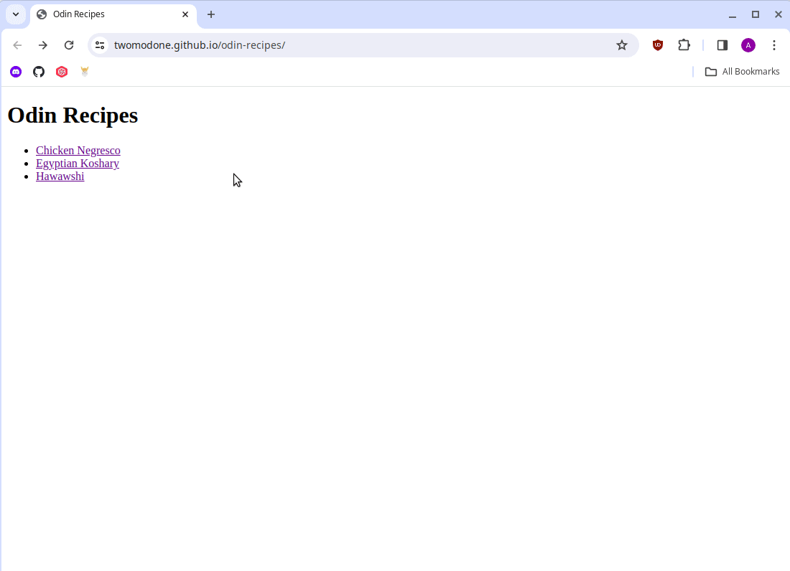

# Odin Recipes

## Introduction
### Project Demo


Odin Recipes is a basic recipe website created as part of The Odin Project's curriculum. The website includes a variety of recipes, each presented on its own dedicated page.

## Technologies Used

This project uses pure HTML to structure the website.

## Features

The website contains:

1. A main index page which includes links to various recipes.
2. Individual recipe pages with:
    * An image of the completed dish.
    * A brief description about the dish.
    * A list of required ingredients.
    * A step-by-step procedure to prepare the dish.

## Live Demo

Experience the website in action! Venture forth to this [Live Demo](https://twomodone.github.io/odin-recipes) and explore the different recipes available.

## Setup and Launch

To set up and launch this project on your local machine, follow the steps below:

1. Clone this repository onto your local machine using Git. You can do this by using the following command in your terminal:

    ```sh
    git clone git@github.com:twomodone/odin-recipes.git
    ```
2. Navigate to the directory where you've cloned the repository.

3. Open the `index.html` file in your browser.

And voila! You should now see the project running in your browser.


## Acknowledgements and Resources

The recipes featured on this website were carefully selected from [AllRecipes](https://www.allrecipes.com).

The images of the dishes were sourced from [Pexels](https://www.pexels.com).
